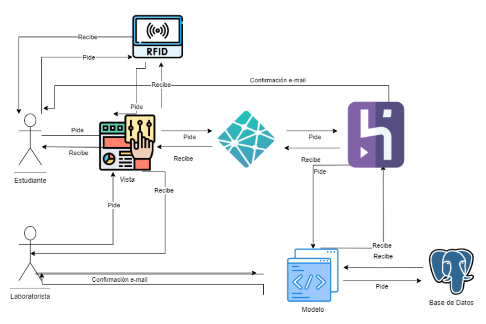
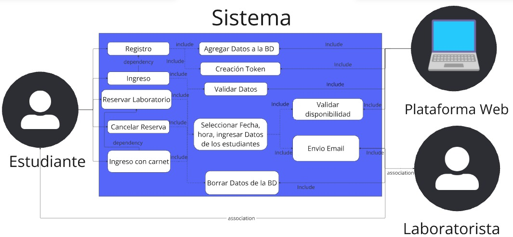
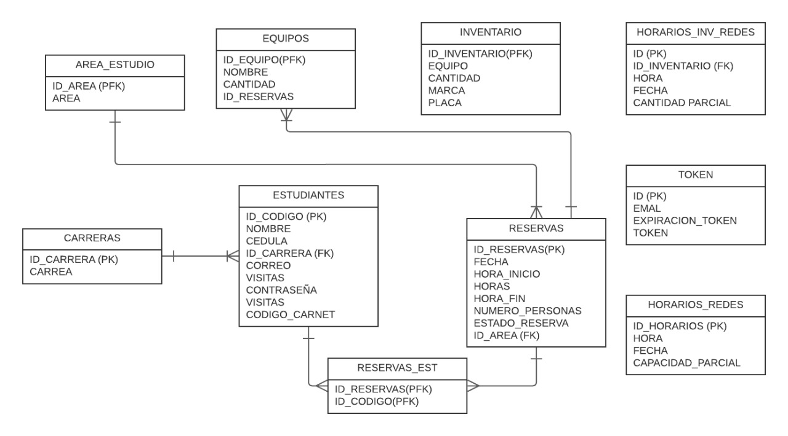
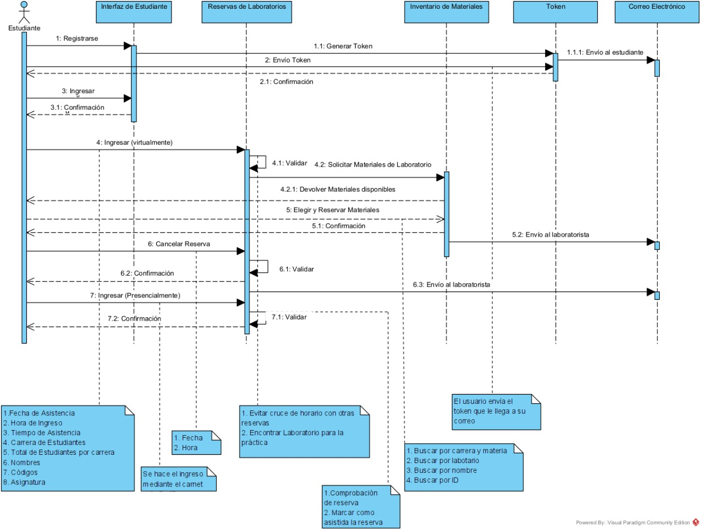
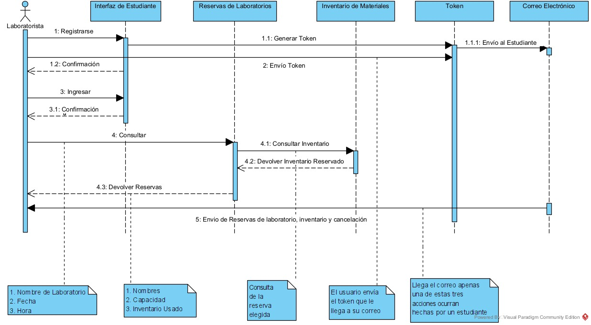

# Documentación del Proyecto

En este documento están los diagramas relacionados con la **Arquitectura de Software** y el **presupuesto estimado** para el proyecto.

## Arquitectura de Software

[Diagrama de Arquitectura de Software](https://drive.google.com/file/d/1FvzcMYTVV7NB1z19Zt-oxsXFAy2BXrDF/view?usp=drive_link)

## Casos de Uso

[Diagrama de Casos de Uso en Miro](https://miro.com/app/board/uXjVKm5h46E=/)

## Base de Datos

[Diagrama de Base de Datos en Lucidchart](https://lucid.app/lucidchart/afb577a9-2267-4bb7-9062-bb9dda0c6c99/edit?invitationId=inv_906b1260-1766-4ec3-9194-c79286e919cd&page=0_0#)

## Presupuesto

**Notas:**
1. Los precios de Azure incluyen base de datos y alojamiento de plataforma web.
2. El lector de RFID no tiene un costo recurrente (por semestre o por hora) ya que solo se paga una vez.

### Roles y Horas

| Roles             | Arquitecto | Front     | Back       | Pruebas   | Requerimientos | Azure      | Lector RFID |
|-------------------|------------|-----------|------------|-----------|----------------|------------|-------------|
| Horas             | 20         | 30        | 30         | 21        | 15             | -          | $71,990.00  |
| Personal          | 1          | 1         | 2          | 5         | 1              | -          |             
| Valor por hora    | $66,800.00 | $27,473.00| $39,567.65 | $18,956.00| $56,000.00     | $1,062.18  |             
| Valor por semestre| $1,336,000.00 | $824,190.00 | $2,374,059.00 | $1,990,380.00 | $840,000.00 | $3,062,883.64 |

### Totales

- **Total por semestre:** $10,427,512.64
- **Total por hora:** $209,858.83
- **Total de mantenimiento:** $208,796.65

### Costos de Azure

| Periodo | USD     | COP           |
|---------|---------|---------------|
| Por mes | $185.27 | $765,720.91   |
| Por hora| $0.257  | $1,062.18     |

[Presupuesto detallado en Google Sheets](https://docs.google.com/spreadsheets/d/1iy-0-saQVEFqAielRdeRvCwI8DtNj4ieGSFYFCTH5F4/edit?gid=0#gid=0)

## Diagramas de Secuencia

- **Estudiante**

- **Laboratorista**
