**Introducción**

La ISO/IEC 15288 es una norma internacional desarrollada para definir y organizar los procesos y actividades necesarios durante el ciclo de vida de los sistemas, independientemente de su naturaleza o complejidad. Esta norma proporciona un marco estructurado que guía la planificación, el desarrollo, la operación, el mantenimiento y la eventual disposición de sistemas complejos.

En el contexto de un proyecto de desarrollo de la plataforma web automatizada para la reserva de laboratorios en la universidad Piloto de Colombia, la aplicación de la norma ISO/IEC 15288 asegura que el sistema sea desarrollado de manera eficiente, escalable y alineado con las necesidades de los usuarios y otros interesados. Este enfoque mejora la organización, la documentación y la calidad del proceso de desarrollo y facilita la trazabilidad de decisiones a lo largo del ciclo de vida del proyecto. En este documento se explica el uso de esta estandarización y las ventajas que conllevan en el desarrollo del proyecto.

**Propósito del Sistema**

El propósito principal del sistema es mejorar la eficiencia en el proceso de reserva de laboratorios en la universidad mediante el desarrollo de una plataforma web automatizada. Este sistema tiene como objetivo automatizar los procesos de reserva manual del laboratorista, integrar laboratorios, estudiantes e inventario en una base de datos, mejorar el sistema de autenticación de asistencia para los usuarios con prácticas y brindar una mejor gestión de reservas para todos los involucrados(estudiante, laboratoristas, jefe laboratorista, gerente laboratorista, desarrollador y asociados con personas que hagan uso de los laboratorios).

Al implementar esta solución, se busca:

* Reducir errores y malentendidos en el proceso de asignación de laboratorios, además de reducir la carga laboral de los laboratoristas.  
* Organizar todos los factores a tener en cuenta a la hora de crear una reserva.  
* Proveer una interfaz mucho más intuitiva y segura a la usada anteriormente

En última instancia, la plataforma busca ser una herramienta confiable que apoye las actividades académicas y administrativas de la institución.

**Referencias Normativas**

1. **ISO/IEC 15288:2015**  
   *"Sistemas de Ingeniería: Procesos del ciclo de vida de sistemas"*. Define los procesos necesarios para gestionar el ciclo de vida completo de un sistema, desde la concepción hasta su disposición final. Esta norma es la principal guía para estructurar las actividades del proyecto.  
2. **ISO/IEC 25010:2011**  
   *"Sistemas y software de ingeniería: Modelos de calidad"*. Proporciona un modelo para evaluar la calidad del software en términos de características como funcionalidad, confiabilidad, usabilidad, eficiencia, mantenibilidad y portabilidad. Es relevante para asegurar la calidad de la plataforma web.  
3. **ISO 9001:2015**  
   *"Sistemas de gestión de la calidad: Requisitos"*. Aunque más general, esta norma asegura la implementación de prácticas organizativas para la mejora continua, lo que puede ser útil en la planificación y gestión del proyecto.  
4. **IEEE 29148:2018**  
   *"Ingeniería de Requisitos"*. Este estándar define buenas prácticas para la gestión y documentación de requisitos, asegurando que el sistema cumpla con las necesidades de los usuarios y otras partes interesadas.  
5. **Guía PMBOK® (7ª Edición)**  
   Publicada por el Project Management Institute (PMI), esta guía es útil para gestionar el proyecto siguiendo las mejores prácticas en gestión de proyectos.  
6. **Normas internas de la universidad**  
   Documentos institucionales que establecen políticas y procedimientos relacionados con el uso de laboratorios, seguridad y gestión de recursos.  
7. **Reglamento General de Protección de Datos (GDPR)**  
   Para garantizar la privacidad y protección de los datos personales de los usuarios que interactúan con la plataforma.

**Definiciones y Abreviaturas**

**Definiciones:**

* **Sistema:** Plataforma Web diseñada para poder realizar reservas en el laboratorio de Redes y Procesadores en la Universidad Piloto de Colombia, asegurando una asignación justa y eficiente de inventario en los horarios disponibles.  
    
* **Usuario:** Persona que interactúa con el sistema, ya sea estudiante o no estudiante, también los laboratoristas, los cuales pueden gestionar sus reservas, el jefe de los laboratoristas, de igual manera el gerente de los laboratoristas o también los desarrolladores.

* **Reserva:** Proceso mediante el cual un estudiante selecciona el área de estudio la cuál quiere realizar una práctica libre, del mismo modo elige un horario específico, inventario el cual necesita para realizar dicha práctica.

* **Inventario:** Conjunto de recursos físicos (equipos, materiales) que están disponibles en el laboratorio para realizar la práctica.

* **Práctica:** Actividad que realiza el estudiante en un laboratorio, el cual requiere de inventario asignado.

* **Carnet:** Identificación del estudiante en la universidad, el cual se utiliza para marcar la asistencia a una reserva anteriormente agendada.

* **Notificación:** Mensaje que llega por medio del correo electrónico cuando se cambió su contraseña, se agendó una reserva con éxito o cuando se cancela una reserva agendada.  
    
* **Área de Estudio:** Especialización o campo de conocimiento al cual pertenece una práctica, como por ejemplo Desarrollo Web, IoT, entre otros.  
    
* **Carrera:**  Programa académico en el que está inscrito un estudiante.

* **Visitas:** Registro de estudiantes que terminan y asisten a una práctica.

* **RFID:**  Identificación por Radiofrecuencia (Radio Frequency Identification). Se emplea para autenticar usuarios mediante el carnet estudiantil.

**Abreviaturas:**

* **SRL:** Sistema de Reservas de Laboratorios.  
    
* **UI:** Interfaz de Usuario (User Interface).  
    
* **DB:** Base de Datos.  
    
* **API:** Interfaz de Programación de Aplicaciones (Application Programming Interface).  
    
* **CRUD:** Operaciones de Crear, Leer, Actualizar y Eliminar datos (Create, Read, Update, Delete).  
    
* **IoT:** Internet de las Cosas (Internet of Things).  
    
* **ID:** Identificación Única (Identifier).  
    
* **SMTP:** Protocolo Simple de Transferencia de Correo (Simple Mail Transfer Protocol).  
    
* **LDAP:** Protocolo Ligero de Acceso a Directorios (Lightweight Directory Access Protocol).  
    
* **HTTP:** Protocolo de Transferencia de Hipertexto (Hypertext Transfer Protocol).  
    
* **HTTPS:** HTTP Seguro (Hypertext Transfer Protocol Secure).  
    
* **JSON:** Notación de Objetos de JavaScript (JavaScript Object Notation).  
    
* **XML:** Lenguaje de Marcado Extensible (Extensible Markup Language).  
    
* **RAM:** Memoria de Acceso Aleatorio (Random Access Memory).  
    
* **CPU:** Unidad Central de Procesamiento (Central Processing Unit).  
    
* **DNS:** Sistema de Nombres de Dominio (Domain Name System).

### **Descripción del Sistema**

El sistema es una **plataforma web automatizada para la reserva de laboratorios** en la Universidad Piloto de Colombia. Sus principales interacciones son:

* **Usuarios**: Estudiantes, laboratoristas, jefes y gerentes de laboratorios que utilizan la plataforma para realizar, gestionar o supervisar reservas.  
* **Bases de Datos**: Se utiliza PostgreSQL para gestionar información de usuarios, reservas, inventario y áreas de estudio.  
* **Servicios de Correo Electrónico**: Se emplea SMTP para notificaciones, como confirmación de reservas, cambio de contraseñas y cancelaciones.  
* **Hardware**: Incluye integración con dispositivos RFID para autenticar usuarios a través de sus carnets estudiantiles.

#### **Arquitectura del Sistema**

* **Esquema**: Arquitectura cliente-servidor.  
* **Frontend**: Desarrollado con tecnologías alojadas en Netlify, proporcionando una interfaz accesible e intuitiva.  
* **Backend**: Implementado en Heroku, gestionando la lógica de negocio y API del sistema.  
* **Base de Datos**: PostgreSQL en Heroku, asegurando una estructura escalable y robusta.

### **Procesos del Ciclo de Vida del Sistema**

#### **Procesos Técnicos**

* **Definición de Requisitos**:  
  Identificación de necesidades como accesibilidad (UI intuitiva), usabilidad (proceso ágil de reservas), y capacidad de integración (compatibilidad con RFID y notificaciones).  
* **Diseño del Sistema**:  
  Incluye modelado de datos, interfaces de usuario claras y definidas, y especificación de APIs REST para la comunicación entre módulos.  
* **Integración**:  
  Los componentes (frontend, backend y base de datos) están interconectados mediante APIs, mientras que los dispositivos RFID interactúan con el backend para autenticar usuarios.  
* **Verificación y Validación**:  
  Se realizan pruebas automatizadas y manuales para asegurar que el sistema cumpla los requisitos funcionales y no funcionales. Herramientas como JMeter evalúan el rendimiento bajo diferentes condiciones de carga.

#### **Procesos de Gestión**

* **Gestión de Proyectos**:  
  Planificación basada en cronogramas con hitos definidos, asignación de recursos a roles como arquitecto, desarrolladores y testers.  
* **Gestión de Riesgos**:  
  Identificación de fallos críticos, como errores en el servidor o sobrecarga del sistema en periodos de alta demanda.  
* **Gestión de Configuración**:  
  Control de cambios en el código y la base de datos mediante herramientas como Git para mantener la trazabilidad.

#### **Procesos Organizacionales**

* **Gestión de Calidad**:  
  Aseguramiento de estándares mediante revisiones de código y pruebas continuas. Se sigue la norma ISO/IEC 25010 para evaluar la calidad del software.  
* **Gestión del Conocimiento**:  
  Documentación de decisiones técnicas, diagramas, y lecciones aprendidas para facilitar futuras mejoras.

#### **Procesos de Acuerdo**

* **Definición de Contratos**:  
  Establecimiento de acuerdos con la universidad para la implementación del sistema y alineación con normas internas.  
* **Adquisiciones**:  
  Identificación de recursos tecnológicos necesarios, como servidores en Heroku y dispositivos RFID.

### **Cronograma del Ciclo de Vida**

* **Fase 1: Análisis y Definición de Requisitos** (Mes 1):  
  Identificar necesidades de usuarios, modelar casos de uso y realizar un estudio de viabilidad técnica y económica.  
* **Fase 2: Diseño del Sistema** (Mes 2):  
  Crear diagramas de arquitectura, modelado de datos y diseño de interfaces.  
* **Fase 3: Desarrollo y Pruebas** (Mes 3 a Mes 4):  
  Desarrollo del frontend y backend; pruebas funcionales, de rendimiento y seguridad.  
* **Fase 4: Implementación y Mantenimiento** (Mes 5 en adelante):  
  Despliegue en los entornos de producción (Netlify y Heroku) y mantenimiento correctivo, adaptativo y preventivo.

#### **Hitos Clave:**

* **Mes 2**: Entrega del MVP para pruebas iniciales.  
* **Mes 5**: Finalización de pruebas y despliegue en producción.  
* **Post-Mes 5**: Inicio del mantenimiento y mejora continua, recopilación de métricas e implementación de nuevas funcionalidades.

**Mantenimiento y Mejora Continua**

Se plantea como objetivo mantener en constante observación el desempeño de la plataforma, estando pendientes de los errores que puedan reportar los usuarios de la misma, que vienen siendo estudiantes, laboratoristas, jefes y gerentes, basado en la retroalimentación de dichos errores junto con adaptaciones y cambios en la plataforma.

Los tipos de mantenimientos que se implementarán serán:

- Correctivo a la hora de identificar errores resultantes de operaciones  
- Adaptativo para realizar las modificaciones necesarias para garantizar compatibilidad con nuevos requisitos  
- Preventivo para evitar a futuro errores previstos

A la hora de implementar el mantenimiento, se llevarán a cabo las siguientes fases:

- Gestión de problemas a la hora de encontrar errores en la plataforma  
- Planificación para asignar tareas, recursos y plazos de solución  
- Ejecución las correcciones y mejoras descritas en la planificación  
- Verificación y validación de pruebas con evaluaciones de impactos previstos y no previstos  
- Liberar la solución y comunicarle a los usuarios que se efectuaron cambios

La mejora continua va a venir muy de la mano con la opinión de la población que haga uso de la plataforma, por ende, los análisis de métrica serán a partir de la recopilación de indicadores de rendimiento y errores, realizando encuestas a los usuarios acerca del nivel de satisfacción que tienen usando el sistema y evaluar la posibilidad de implementar nuevas funcionalidades y buscar optimizar procesos internos de la plataforma.

Adicionalmente, existe la posibilidad de escalar el proyecto y contemplar la funcionalidad del sistema de reservas funcione para todos los laboratorios del edificio F, y así mismo, para todas los laboratorios de la universidad. En caso de concretarse esta opción, se mantendrán de la misma manera los principios de mantenimiento, acompañados de los cambios requeridos para que la operatividad del nuevo sistema sea óptima.

**Diagramas de Casos de Uso**  

****

**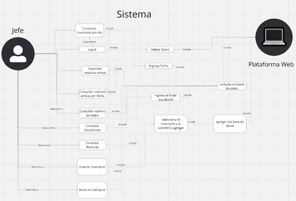**

**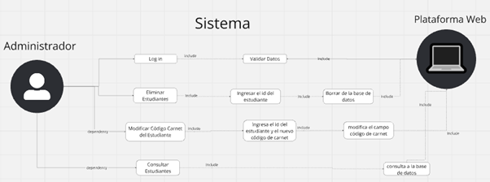**

**Historias de usuario**

**Pruebas con JMETER**

Para probar la eficiencia de la plataforma web se llevaron a cabo distintas pruebas para analizar el comportamiento de la misma mediante varias peticiones al mismo tiempo, específicamente 200, estos fueron los resultados dados por JMeter.  
**Registrar Estudiante**  
  
  
Nota: Solo aparece bien un request porque solo se puede agregar un estudiante con el mismo correo electronico  
**Correo Existente**  

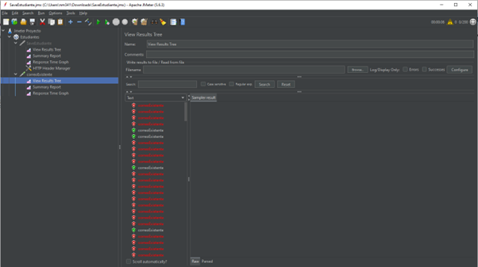  
**RESERVAS EXISTENTES**  
  
  
**LOGIN ESTUDIANTE**  
****  
****  
**OBTENER INVENTARIO**  
**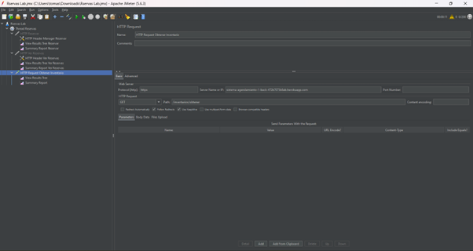**  
****  
**TOTAL DE RESERVAS ACTIVAS**  
****  
**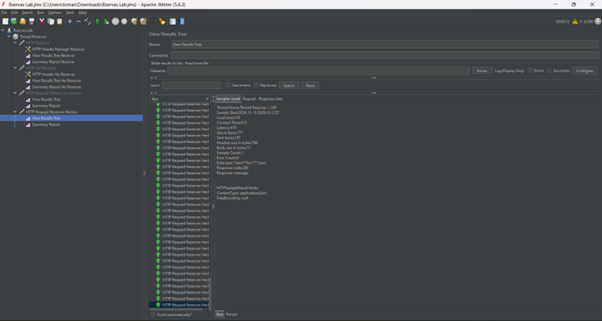**  
**TOTAL DE RESERVAS HECHAS**  
****  
**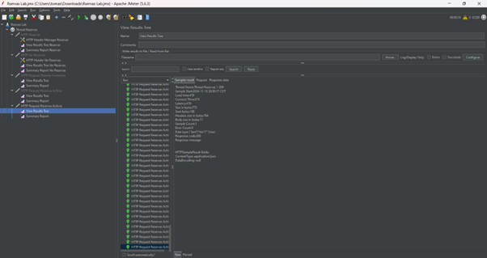**  
**RESERVAS ACTIVAS POR ESTUDIANTE**  
****  
**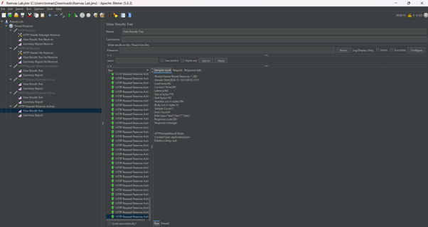**  
**RESERVAS POR FECHA**  
**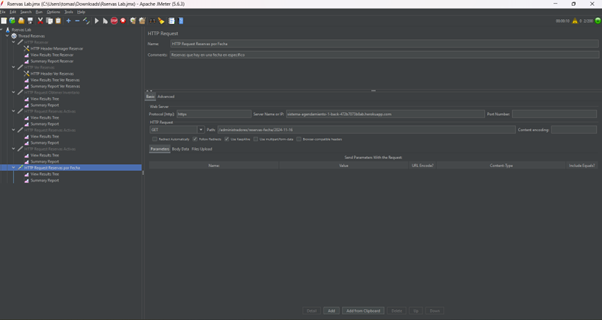**  
****  
**CREAR RESERVAS**  
****  
****  
Nota: solo aparece una request correcta debido a que solo se puede crear una reserva con el mismo id para ese día.  
**CANCELAR RESERVAS**  
**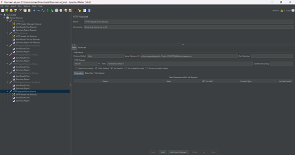**  
**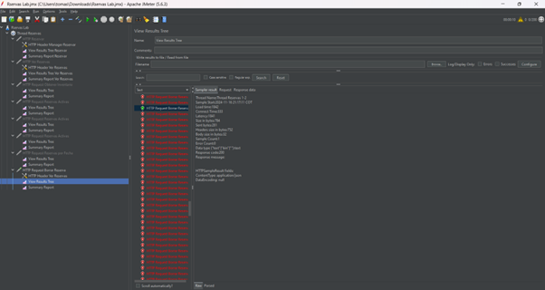**  
Nota: solo aparece una request correcta debido a que solo se puede eliminar una vez aquella reserva.

**Arquitectura de Software:**

A continuación se puede notar el arquitectura que se utilizó para la plataforma de Reserva de laboratorios de la universidad, la cual usó base de datos de PostgreSQL, hosteada en heroku de igual modo que el backend y el frontend se encuentra hosteado en Netlify.  
****

**Modelado de Datos:**

A continuación se observa el modelado de datos utilizado para la base de datos del Sistema de reserva del laboratorio:  
****  
**Diagrama de secuencia:**

**Estudiante:**  
**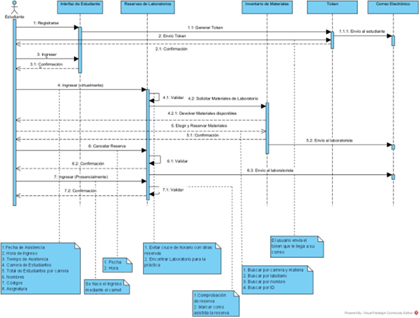**

**Laboratorista:**  
****  
**Jefe de Laboratorista:**  
****

**Gerente de Laboratorista:**

****  
**Desarrolladores:**

**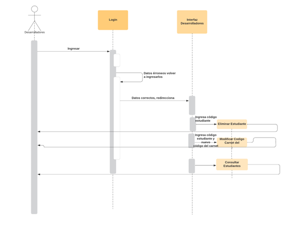**

**Bibliografías:**

* International Organization for Standardization. (2015). *ISO/IEC 15288: Systems and software engineering — System life cycle processes*. Geneva, Switzerland: ISO.  
* International Organization for Standardization. (2011). *ISO/IEC 25010: Systems and software engineering — Systems and software quality requirements and evaluation (SQuaRE) — System and software quality models*. Geneva, Switzerland: ISO.  
* International Organization for Standardization. (2015). *ISO 9001: Quality management systems — Requirements*. Geneva, Switzerland: ISO.  
* Institute of Electrical and Electronics Engineers. (2018). *IEEE 29148: Systems and software engineering — Life cycle processes — Requirements engineering*. Piscataway, NJ: IEEE Standards Association.  
* Project Management Institute. (2021). *A guide to the Project Management Body of Knowledge (PMBOK® Guide) (7th ed.)*. Newtown Square, PA: PMI.  
* Parlamento Europeo y Consejo de la Unión Europea. (2016). *Reglamento General de Protección de Datos (GDPR)*. Diario Oficial de la Unión Europea, 119, 1-88.

