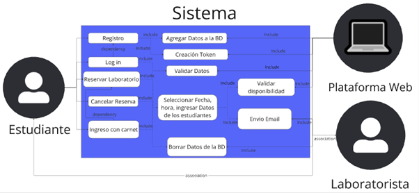

## **Introducción**

La ISO/IEC 15288 es una norma internacional desarrollada para definir y organizar los procesos y actividades necesarios durante el ciclo de vida de los sistemas, independientemente de su naturaleza o complejidad. Esta norma proporciona un marco estructurado que guía la planificación, el desarrollo, la operación, el mantenimiento y la eventual disposición de sistemas complejos.

En el contexto de un proyecto de desarrollo de la plataforma web automatizada para la reserva de laboratorios en la universidad Piloto de Colombia, la aplicación de la norma ISO/IEC 15288 asegura que el sistema sea desarrollado de manera eficiente, escalable y alineado con las necesidades de los usuarios y otros interesados. Este enfoque mejora la organización, la documentación y la calidad del proceso de desarrollo y facilita la trazabilidad de decisiones a lo largo del ciclo de vida del proyecto. En este documento se explica el uso de esta estandarización y las ventajas que conllevan en el desarrollo del proyecto.

## **Propósito del Sistema**

El propósito principal del sistema es mejorar la eficiencia en el proceso de reserva de laboratorios en la universidad mediante el desarrollo de una plataforma web automatizada. Este sistema tiene como objetivo automatizar los procesos de reserva manual del laboratorista, integrar laboratorios, estudiantes e inventario en una base de datos, mejorar el sistema de autenticación de asistencia para los usuarios con prácticas y brindar una mejor gestión de reservas para todos los involucrados(estudiante, laboratoristas, jefe laboratorista, gerente laboratorista, desarrollador y asociados con personas que hagan uso de los laboratorios).

Al implementar esta solución, se busca:

* Reducir errores y malentendidos en el proceso de asignación de laboratorios, además de reducir la carga laboral de los laboratoristas.  
* Organizar todos los factores a tener en cuenta a la hora de crear una reserva.  
* Proveer una interfaz mucho más intuitiva y segura a la usada anteriormente

En última instancia, la plataforma busca ser una herramienta confiable que apoye las actividades académicas y administrativas de la institución.

## **Referencias Normativas**

1. **ISO/IEC 15288:2015**  
   *"Sistemas de Ingeniería: Procesos del ciclo de vida de sistemas"*. Define los procesos necesarios para gestionar el ciclo de vida completo de un sistema, desde la concepción hasta su disposición final. Esta norma es la principal guía para estructurar las actividades del proyecto.  
2. **ISO/IEC 25010:2011**  
   *"Sistemas y software de ingeniería: Modelos de calidad"*. Proporciona un modelo para evaluar la calidad del software en términos de características como funcionalidad, confiabilidad, usabilidad, eficiencia, mantenibilidad y portabilidad. Es relevante para asegurar la calidad de la plataforma web.  
3. **ISO 9001:2015**  
   *"Sistemas de gestión de la calidad: Requisitos"*. Aunque más general, esta norma asegura la implementación de prácticas organizativas para la mejora continua, lo que puede ser útil en la planificación y gestión del proyecto.  
4. **IEEE 29148:2018**  
   *"Ingeniería de Requisitos"*. Este estándar define buenas prácticas para la gestión y documentación de requisitos, asegurando que el sistema cumpla con las necesidades de los usuarios y otras partes interesadas.  
5. **Guía PMBOK® (7ª Edición)**  
   Publicada por el Project Management Institute (PMI), esta guía es útil para gestionar el proyecto siguiendo las mejores prácticas en gestión de proyectos.  
6. **Normas internas de la universidad**  
   Documentos institucionales que establecen políticas y procedimientos relacionados con el uso de laboratorios, seguridad y gestión de recursos.  
7. **Reglamento General de Protección de Datos (GDPR)**  
   Para garantizar la privacidad y protección de los datos personales de los usuarios que interactúan con la plataforma.

## **Definiciones y Abreviaturas**

### **Definiciones:**

* **Sistema:** Plataforma Web diseñada para poder realizar reservas en el laboratorio de Redes y Procesadores en la Universidad Piloto de Colombia, asegurando una asignación justa y eficiente de inventario en los horarios disponibles.  
    
* **Usuario:** Persona que interactúa con el sistema, ya sea estudiante o no estudiante, también los laboratoristas, los cuales pueden gestionar sus reservas, el jefe de los laboratoristas, de igual manera el gerente de los laboratoristas o también los desarrolladores.

* **Reserva:** Proceso mediante el cual un estudiante selecciona el área de estudio la cuál quiere realizar una práctica libre, del mismo modo elige un horario específico, inventario el cual necesita para realizar dicha práctica.

* **Inventario:** Conjunto de recursos físicos (equipos, materiales) que están disponibles en el laboratorio para realizar la práctica.

* **Práctica:** Actividad que realiza el estudiante en un laboratorio, el cual requiere de inventario asignado.

* **Carnet:** Identificación del estudiante en la universidad, el cual se utiliza para marcar la asistencia a una reserva anteriormente agendada.

* **Notificación:** Mensaje que llega por medio del correo electrónico cuando se cambió su contraseña, se agendó una reserva con éxito o cuando se cancela una reserva agendada.  
    
* **Área de Estudio:** Especialización o campo de conocimiento al cual pertenece una práctica, como por ejemplo Desarrollo Web, IoT, entre otros.  
    
* **Carrera:**  Programa académico en el que está inscrito un estudiante.

* **Visitas:** Registro de estudiantes que terminan y asisten a una práctica.

* **RFID:**  Identificación por Radiofrecuencia (Radio Frequency Identification). Se emplea para autenticar usuarios mediante el carnet estudiantil.

### **Abreviaturas:**

* **SRL:** Sistema de Reservas de Laboratorios.  
    
* **UI:** Interfaz de Usuario (User Interface).  
    
* **DB:** Base de Datos.  
    
* **API:** Interfaz de Programación de Aplicaciones (Application Programming Interface).  
    
* **CRUD:** Operaciones de Crear, Leer, Actualizar y Eliminar datos (Create, Read, Update, Delete).  
    
* **IoT:** Internet de las Cosas (Internet of Things).  
    
* **ID:** Identificación Única (Identifier).  
    
* **SMTP:** Protocolo Simple de Transferencia de Correo (Simple Mail Transfer Protocol).  
    
* **LDAP:** Protocolo Ligero de Acceso a Directorios (Lightweight Directory Access Protocol).  
    
* **HTTP:** Protocolo de Transferencia de Hipertexto (Hypertext Transfer Protocol).  
    
* **HTTPS:** HTTP Seguro (Hypertext Transfer Protocol Secure).  
    
* **JSON:** Notación de Objetos de JavaScript (JavaScript Object Notation).  
    
* **XML:** Lenguaje de Marcado Extensible (Extensible Markup Language).  
    
* **RAM:** Memoria de Acceso Aleatorio (Random Access Memory).  
    
* **CPU:** Unidad Central de Procesamiento (Central Processing Unit).  
    
* **DNS:** Sistema de Nombres de Dominio (Domain Name System).

### **Descripción del Sistema**

El sistema es una **plataforma web automatizada para la reserva de laboratorios** en la Universidad Piloto de Colombia. Sus principales interacciones son:

* **Usuarios**: Estudiantes, laboratoristas, jefes y gerentes de laboratorios que utilizan la plataforma para realizar, gestionar o supervisar reservas.  
* **Bases de Datos**: Se utiliza PostgreSQL para gestionar información de usuarios, reservas, inventario y áreas de estudio.  
* **Servicios de Correo Electrónico**: Se emplea SMTP para notificaciones, como confirmación de reservas, cambio de contraseñas y cancelaciones.  
* **Hardware**: Incluye integración con dispositivos RFID para autenticar usuarios a través de sus carnets estudiantiles.

#### **Arquitectura del Sistema**

* **Esquema**: Arquitectura cliente-servidor.  
* **Frontend**: Desarrollado con tecnologías alojadas en Netlify, proporcionando una interfaz accesible e intuitiva.  
* **Backend**: Implementado en Heroku, gestionando la lógica de negocio y API del sistema.  
* **Base de Datos**: PostgreSQL en Heroku, asegurando una estructura escalable y robusta.

### **Procesos del Ciclo de Vida del Sistema**

#### **Procesos Técnicos**

* **Definición de Requisitos**:  
  Identificación de necesidades como accesibilidad (UI intuitiva), usabilidad (proceso ágil de reservas), y capacidad de integración (compatibilidad con RFID y notificaciones).  
* **Diseño del Sistema**:  
  Incluye modelado de datos, interfaces de usuario claras y definidas, y especificación de APIs REST para la comunicación entre módulos.  
* **Integración**:  
  Los componentes (frontend, backend y base de datos) están interconectados mediante APIs, mientras que los dispositivos RFID interactúan con el backend para autenticar usuarios.  
* **Verificación y Validación**:  
  Se realizan pruebas automatizadas y manuales para asegurar que el sistema cumpla los requisitos funcionales y no funcionales. Herramientas como JMeter evalúan el rendimiento bajo diferentes condiciones de carga.

#### **Procesos de Gestión**

* **Gestión de Proyectos**:  
  Planificación basada en cronogramas con hitos definidos, asignación de recursos a roles como arquitecto, desarrolladores y testers.  
* **Gestión de Riesgos**:  
  Identificación de fallos críticos, como errores en el servidor o sobrecarga del sistema en periodos de alta demanda.  
* **Gestión de Configuración**:  
  Control de cambios en el código y la base de datos mediante herramientas como Git para mantener la trazabilidad.

#### **Procesos Organizacionales**

* **Gestión de Calidad**:  
  Aseguramiento de estándares mediante revisiones de código y pruebas continuas. Se sigue la norma ISO/IEC 25010 para evaluar la calidad del software.  
* **Gestión del Conocimiento**:  
  Documentación de decisiones técnicas, diagramas, y lecciones aprendidas para facilitar futuras mejoras.

#### **Procesos de Acuerdo**

* **Definición de Contratos**:  
  Establecimiento de acuerdos con la universidad para la implementación del sistema y alineación con normas internas.  
* **Adquisiciones**:  
  Identificación de recursos tecnológicos necesarios, como servidores en Heroku y dispositivos RFID.

### **Cronograma del Ciclo de Vida**

* **Fase 1: Análisis y Definición de Requisitos** (Mes 1):  
  Identificar necesidades de usuarios, modelar casos de uso y realizar un estudio de viabilidad técnica y económica.  
* **Fase 2: Diseño del Sistema** (Mes 2):  
  Crear diagramas de arquitectura, modelado de datos y diseño de interfaces.  
* **Fase 3: Desarrollo y Pruebas** (Mes 3 a Mes 4):  
  Desarrollo del frontend y backend; pruebas funcionales, de rendimiento y seguridad.  
* **Fase 4: Implementación y Mantenimiento** (Mes 5 en adelante):  
  Despliegue en los entornos de producción (Netlify y Heroku) y mantenimiento correctivo, adaptativo y preventivo.

#### **Hitos Clave:**

* **Mes 2**: Entrega del MVP para pruebas iniciales.  
* **Mes 5**: Finalización de pruebas y despliegue en producción.  
* **Post-Mes 5**: Inicio del mantenimiento y mejora continua, recopilación de métricas e implementación de nuevas funcionalidades.

### **Mantenimiento y Mejora Continua**

Se plantea como objetivo mantener en constante observación el desempeño de la plataforma, estando pendientes de los errores que puedan reportar los usuarios de la misma, que vienen siendo estudiantes, laboratoristas, jefes y gerentes, basado en la retroalimentación de dichos errores junto con adaptaciones y cambios en la plataforma.

Los tipos de mantenimientos que se implementarán serán:

- Correctivo a la hora de identificar errores resultantes de operaciones  
- Adaptativo para realizar las modificaciones necesarias para garantizar compatibilidad con nuevos requisitos  
- Preventivo para evitar a futuro errores previstos

A la hora de implementar el mantenimiento, se llevarán a cabo las siguientes fases:

- Gestión de problemas a la hora de encontrar errores en la plataforma  
- Planificación para asignar tareas, recursos y plazos de solución  
- Ejecución las correcciones y mejoras descritas en la planificación  
- Verificación y validación de pruebas con evaluaciones de impactos previstos y no previstos  
- Liberar la solución y comunicarle a los usuarios que se efectuaron cambios

La mejora continua va a venir muy de la mano con la opinión de la población que haga uso de la plataforma, por ende, los análisis de métrica serán a partir de la recopilación de indicadores de rendimiento y errores, realizando encuestas a los usuarios acerca del nivel de satisfacción que tienen usando el sistema y evaluar la posibilidad de implementar nuevas funcionalidades y buscar optimizar procesos internos de la plataforma.

Adicionalmente, existe la posibilidad de escalar el proyecto y contemplar la funcionalidad del sistema de reservas funcione para todos los laboratorios del edificio F, y así mismo, para todas los laboratorios de la universidad. En caso de concretarse esta opción, se mantendrán de la misma manera los principios de mantenimiento, acompañados de los cambios requeridos para que la operatividad del nuevo sistema sea óptima.

**Diagramas de Casos de Uso**  

****

****

****

## **Historias de usuario**

---

### **Historia de Usuario 1.1 – Registro e inicio de sesión por parte del usuario**

 - **Descripción:**
Se requiere registrar e ingresar al usuario hacia la plataforma para poder efectuar procesos posteriores, por ende, el mismo usuario debe de contar con credenciales establecidas y válidas.
 - **Como:** usuario (Estudiante/laboratorista).
 - **Quiero:** Acceder a la plataforma a través de un usuario y contraseña ya establecidos. En caso de aún no contar con credenciales válidas que existan en la base de datos, debe permitirle al usuario llegar a la creación de las mismas para que pueda efectuar el inicio de sesión.
 - **Para:** Tener acceso al servicio de la plataforma, la cual le permitirá reservar una sala de laboratorio para efectuar una correspondiente práctica.

**Criterio de aceptación 1** 
En el proceso de inscripción a la plataforma, debe existir una diferenciación para aquellos usuarios que sean estudiantes y aquellos que no pertenezcan a la universidad
 - **Dado:** Que debe distinguirse aquellos estudiantes que posean un carnet que indique la pertenencia a la institución de aquellos que no.
 - **Cuando:** El interesado esté llevando a cabo el proceso de inscripción.
 - **Entonces:** Se mostrará una interfaz que separe a los estudiantes de los no estudiantes. A los estudiantes se les pedirá el código del carnet, el nombre, la cédula, un correo electrónico válido, una contraseña, la carrera a la que pertenecen y validar un recaptcha. 
 En caso de no ser un estudiante que pertenezca a la universidad, se le pedirán los mismos campos de datos que al estudiante perteneciente a la institución, únicamente difiere que no se le pedirá el código del carnet ya que no cuenta con él.
 Las credenciales del estudiante perteneciente será el código del carnet y la contraseña que haya ingresado, mientras que para el estudiante que no pertenece a la universidad, será la cédula y la contraseña que haya ingresado.

**Criterio de aceptación 2** 
El usuario debe ser capaz de iniciar sesión en la plataforma con credenciales ya existentes en la base de datos.
 - **Dado:** Que al haber efectuado ya el proceso de inscripción, el usuario se encuentra con los insumos necesarios para poder iniciar sesión.
 - **Cuando:** El usuario quiera iniciar sesión en la plataforma y de clic al botón “Entrar”.
 - **Entonces:** Se llevará a cabo la verificación de la existencia de las credenciales ingresadas en los campos de la interfaz, que corresponden al número de identificación, diferenciando cuando sea estudiante perteneciente a estudiante no perteneciente y la contraseña, datos que serán enviados a comparar a la base de datos y en caso de coincidir, se le permitirá el acceso a la plataforma, de caso contrario, se le negará la entrada a la plataforma acompañado del mensaje “Error en inicio de sesión”.

**OBSERVACIÓN:**

La consideración de los estudiantes no pertenecientes radica en que estudiantes de distintas universidades han demostrado interés por tomar clases dictadas por la institución. Por ende, al efectuar dichas materias, existe una necesidad implícita por realizar prácticas en los laboratorios de la universidad.
Por otro lado, los roles de laboratoristas, jefe y gerente ya cuentan con credenciales creadas en la base de datos de la aplicación, donde el registro de cada fila contiene un correo y una contraseña para cada perfil.

---

### **Historia de Usuario 1.2 – Reserva de laboratorio**

 - **Descripción:** Al haber ingresado a la plataforma, el usuario desea llevar a cabo la reserva del laboratorio.
 - **Como:** usuario (estudiante)
 - **Quiero:** Reservar una sala de laboratorio después de haber llenado los campos de fecha de asistencia, hora de ingreso, horas de laboratorio, carrera y total de acompañantes, seguido de verificaciones del sistema en términos de capacidad, inventario y materias.
 - **Para:** Efectuar una determinada práctica en una hora disponible y poder usar el inventario adecuado para la misma.

**Criterio de aceptación 1** 
La práctica a realizar debe ser acorde a una materia que debe tener el correspondiente inventario.
 - **Dado:** Que las distintas prácticas difieren en cuanto a conceptos e implícitamente materiales, por lo cual difiere en términos de inventario y salón según la necesidad del usuario.
 - **Cuando:** El usuario esté especificando la materia de la práctica que va a llevar a cabo.
 - **Entonces:** Se buscará en la base de datos la materia y la disponibilidad de capacidad laboratorio donde se llevan a cabo dichas prácticas, para así saber cuál es el área de interés
 del usuario para llevar a cabo la reserva.

**Criterio de aceptación 2** 
El usuario debe llenar los campos de fecha de ingreso, hora de ingreso, horas a realizar y total de acompañantes.
 - **Dado:** Que indicar la hora de llegada y la hora de duración son aspectos relevantes en el proceso de reserva para verificar la disponibilidad de inventario y de salón.
 - **Cuando:** El usuario esté especificando los detalles de su reserva.
 - **Entonces:** Se buscará en la base de datos que en esa hora no se esté cruzando ni con alguna clase, reserva o que la capacidad del laboratorio no sea superada, y adicionalmente, la disponibilidad del inventario con respecto a la materia a ejecutar previamente mencionada en el criterio 1. 
 Si no existe ningún cruce en términos de laboratorio, de capacidad y de material, se hará efectiva la reserva, de caso contrario, se le informará al usuario “No es posible agendar la práctica en el horario solicitado”. El usuario puede volver a llenar la reserva variando los campos de hora y fecha.

**OBSERVACIÓN:**

En versiones pasadas de esta historia de usuario se mencionó que, inicialmente, las primeras entregas no mostrarían el mensaje por el cual no se lograra hacer la reserva en términos o de disponibilidad de inventario o de capacidad del laboratorio. En consecuente, dentro de las funcionalidades de la última versión del proyecto entregado a la fecha, si muestra la razón por la cual no se puede obtener la reserva.
Por otro lado, se manejaron un par de limitaciones por parte del usuario que quiera reservar el laboratorio. Inicialmente, no puede usar más de 3 horas de sala, tampoco puede hacer más de una reserva al día, debe incluirse a sí mismo en la lista de estudiantes que aparece antes del botón de reservar y, por último, se pueden solicitar como máximo 3 elementos de inventario por estudiante listado en la práctica.

---

### **Historia de Usuario 2.1– Confirmación de reserva del laboratorio**

 - **Descripción:** El usuario recibirá una confirmación de la reserva que acaba de hacer previamente frente a la validación de todas las condiciones que requiere apartar una sala.
 - **Como: usuario (estudiante)**
 - **Quiero:** Recibir una confirmación de la reserva de laboratorio exitosa hecha a través del correo electrónico, que es el mismo usuario de la plataforma
 - **Para:** Efectuar una práctica que manifiesta seguridad, transparencia y comunicación efectiva con el usuario

**Criterio de aceptación 1** 
La reserva cumplió con todos los criterios de aceptación de la historia de usuario 1.2.
 - **Dado:** Que la historia de usuario anterior presentaba las condiciones y requerimientos establecidos a la hora de realizar una reserva óptima en todos los aspectos (horario, aforo e instrumentación).
 - **Cuando:** El usuario llene todos los campos del proceso de reserva y ninguna validación de disponibilidad haya presentado inconvenientes.
 - **Entonces:** Hará efectiva la reserva, añadiéndola a la base de datos con la información pertinente a la práctica.

**Criterio de aceptación 2** 
El usuario debe revisar un tiempo después su correo electrónico.
 - **Dado:** Que la confirmación enviada por la plataforma será a través del correo electrónico brindado por el usuario en el proceso de registro en la plataforma.
 - **Cuando:** El sistema haya añadido de manera exitosa la reserva del usuario a la base de datos.
 - **Entonces:** La plataforma enviará de manera automática un correo donde se le notifique al usuario los detalles de su reserva, donde se le va a recordar la hora, fecha, práctica, elementos de inventario y acompañantes de la reserva que fueron diligenciadas en los campos llenados en el proceso, para que el usuario tenga presente dicho evento y a su vez, evidencie el funcionamiento óptimo de la plataforma.

**OBSERVACIÓN:** 

Después de pruebas realizadas, se sabe con certeza que para correos de extensión ‘@gmail.com’ el correo de confirmación de la reserva llega a la bandeja principal, mientras que en correos de extensión ‘@outlook.com’ o en este caso, haciendo uso de la suite de office con el dominio de la universidad ‘@upc.edu.co’ llega a la bandeja de spam. Por ende, se le recomienda al usuario revisar ambas bandejas para visualizar el mensaje de verificación. Adicionalmente, se le envía al laboratorista un correo donde se le informan los detalles de dicha reserva para que esté enterado y pueda administrar su agenda de manera correcta.
También se le recomienda al usuario recargar el correo durante un pequeño periodo de tiempo, aproximadamente un par de minutos, ya que existe la posibilidad de que la llegada del correo de confirmación no sea de manera instantánea, ya que puede tardarse un poco más de lo esperado por distintos motivos, tales como retrasos en el servidor de correo, problemas de red, configuración del correo del cliente, etc.

---

### **Historia de Usuario 3.1– Manejo de la plataforma por parte del administrador**

 - **Descripción:** El laboratorista, quien en este caso va a ser usuario de administrador, va a poder interactuar con los distintos elementos que se le muestran en su interfaz propia.
 - **Como:** usuario administrador (laboratorista).
 - **Quiero:* *Manejar de manera adecuada la interfaz entregada.
 - **Para:** Ver aprovechar la funcionalidad completa del sistema, así como optimizar el tiempo y distribuir mejor las tareas del día.

**Criterio de aceptación 1** 
El administrador inicie sesión con sus credenciales
 - **Dado:** Que los administradores, en este caso los laboratoristas, tienen credenciales distintas a los estudiantes.
 - **Cuando:** El administrador haya ingresado sus credenciales y le haya dado clic al botón “Entrar” para iniciar sesión.
 - **Entonces:** Efectuará el inicio de sesión de manera exitosa y accederá a la interfaz propia de los administradores para ver las reservas.

**Criterio de aceptación 2** 
El administrador pueda confirmar una reserva realizada en la plataforma.
 - **Dado:** Que el administrador va a validar que la reserva se haya efectuado en la fecha y hora correspondiente.
 - **Cuando:** El estudiante le comunique al administrador(laboratorista) que quiere empezar y finalizar su reserva.
 - **Entonces:** Se efectuará todo el proceso mencionado en la HU4.1.

**Criterio de aceptación 3** 
El administrador vaya a reservar por parte de un estudiante.
 - **Dado:** Que el administrador(laboratorista) debe tener la posibilidad de reservar a nombre de un usuario estudiante/no estudiante.
 - **Cuando:** Por poco probable que sea, exista la posibilidad de que un usuario estudiante/no estudiante no se encuentre con los medios para realizar un proceso de reserva por sí mismo.
 - **Entonces:** El usuario estudiante/no estudiante se comunicará con el laboratorista ya sea vía telefónica, por correo o presencialmente donde le indicará cada uno de los campos a llenar para efectuar una reserva y el laboratorista le colaborará con el proceso de diligenciar estos datos en la plataforma.

**Criterio de aceptación 4** 
El administrador hace una consulta sobre todas las reservas activas de un estudiante.
 - **Dado:** Que el administrador quiere conocer toda la información acerca de las reservas hechas por parte de ese usuario
 - **Cuando:** El administrador quiera ver todas las reservas a nombre de ese usuario en la interfaz.
 - **Entonces:** La plataforma enviará los resultados a partir de la información en la base de datos a la fecha. Por lo tanto, se le enviará los datos de todas las reservas activas en la plataforma, devolviendo el contenido del día, la hora, la práctica y los elementos de inventario seleccionados, en caso de no encontrar registros en la base de datos, se le informará al administrador que no hay reservas para dicho estudiante.

**Criterio de aceptación 5** 
El administrador hace una consulta sobre todas las reservas activas por fecha.
 - **Dado:** Que el administrador quiere conocer toda la información acerca de las reservas hechas para una fecha en concreto
 - **Cuando:** El administrador quiera ver todas las reservas en una fecha específica.
 - **Entonces:** La plataforma enviará los resultados a partir de la información en la base de datos a la fecha. Por lo tanto, se le enviará los datos de todas las reservas activas en la plataforma, devolviendo el contenido del día, la hora, la práctica y los elementos de inventario seleccionados, en caso de no encontrar registros en la base de datos, se le informará al administrador que no hay reservas para dicho estudiante.

**Criterio de aceptación 6** 
El administrador hace una consulta para conocer el número de visitas de un estudiante.
 - **Dado:** Que el administrador quiere conocer la cantidad de veces que ha ido un estudiante en específico
 - **Cuando:** El administrador quiera ver o confirmar la cantidad de veces que un usuario haya ido a realizar una práctica de laboratorio.
 - **Entonces:** La plataforma enviará los resultados a partir de la información en la base de datos a la fecha. Por lo tanto, se le enviará la cantidad de veces que ese usuario estudiante/no estudiante haya ido a realizar su práctica de laboratorio previamente reservada datos de todas las reservas activas en la plataforma.

**Criterio de aceptación 7** 
El administrador hace una consulta sobre los estudiantes registrados en el sistema.
 - **Dado:** Que el administrador quiere conocer la información detallada acerca los usuarios registrados en la plataforma
 - **Cuando:** El administrador quiera verificar la existencia de un usuario y su información.
 - **Entonces:** La plataforma enviará los resultados a partir de la información en la base de datos a la fecha. Por lo tanto, se le enviará todos los usuarios estudiantes/no estudiantes que existan en la base de datos que hayan sido registrados a través de la plataforma.

**Criterio de aceptación 8** 
El administrador hace una consulta sobre todas las reservas registradas.
 - **Dado:** Que el administrador quiere conocer la información detallada acerca todas las reservas
 - **Cuando:** El administrador quiera visualizar la información detallada acerca todas las reservas registradas en el sistema.
 - **Entonces:** La plataforma enviará los resultados a partir de la información en la base de datos a la fecha. Por lo tanto, se le enviará todas las reservas que estén en la base de datos, con la respectiva información de la reserva que previamente se ha mencionado en los procesos de reserva.

**Criterio de aceptación 9** 
El administrador va a borrar una reserva.
 - **Dado:** Que el administrador quiera cancelar una reserva previamente hecha a través de la plataforma
 - **Cuando:** Se le solicite hacerlo, ya sea porque el usuario de la reserva lo pidió o porque el laboratorista vio que no llegó a la hora de la reserva.
 - **Entonces:** La plataforma realizará una modificación en la base de datos, eliminando la reserva en cuestión, y, por ende, todos sus detalles, liberando cupos de capacidad y de disponibilidad de inventario.

**OBSERVACIÓN:** 

Cabe aclarar que no deben poner número telefónico ya que ellos cuentan con su propia extensión en caso de querer contactarse con ellos, tal y como funciona el resto de entidades administrativas de la universidad. Adicionalmente, el laboratorista podrá tener acceso a los registros de la base de datos, pero no podrá manipular la base de datos. El permiso a la visibilidad de los registros lo hacen para realizar procesos de supervisión y control de los laboratorios y los insumos de los mismos para realizar informes posteriores.

---

### **Historia de Usuario 3.2 – Validación de reserva con el carnet**
 - **Descripción:** Cuando el estudiante o grupo de estudiantes vayan a entrar al laboratorio a realizar la práctica de la reserva, se realizará la verificación de asistencia a partir del escaneo del carnet estudiantil.
 - **Como: Uusuario (estudiante)**
 - **Quiero:** Confirmar mi asistencia a la reserva previamente agendada en la plataforma.
 - **Para:** Validar de manera segura la asistencia de los integrantes de la reserva a partir del usuario que realizó la reserva.

**Criterio de aceptación 1** 
El usuario debe llevar el carnet consigo mismo a la hora de pasarlo por el lector.
 - **Dado:** Que a partir de la lectura del carnet va a confirmarse la reserva.
 - **Cuando:** El usuario que realizó la reserva vaya a entrar al laboratorio.
 - **Entonces:** Se hará la validación de las credenciales del carnet. En caso de coincidir con el identificador de carnet del titular, se modificará en la base de datos el número de visitas, tanto del titular como de los integrantes y el estado de la reserva.
 En caso de que el código leído coincida con el registro del usuario en la base de datos, se enviará un mensaje de confirmación de asistencia al correo del usuario, en caso que no, se enviará un mensaje al laboratorista de que el carnet escaneado no corresponde al registro del usuario que realizó la reserva

**Criterio de aceptación 2** 
El usuario que realizó la reserva debe estar presente en la práctica.
 - **Dado:** Que la confirmación de la asistencia se hace a partir de la presencia del usuario que efectuó la reserva
 - **Cuando:** El usuario vaya a validar su asistencia en la práctica de laboratorio.
 - **Entonces:** Se realizará la búsqueda en la base de datos y se harán las modificaciones previamente mencionadas.

**OBSERVACIÓN:**

En caso de que el código arrojado a la hora de escanear el carnet para confirmar la reserva por parte del titular no coincida con el registro de la base de datos, se le notificará al laboratorista esta situación. Las razones pueden ser las siguientes:
  - El chip del carnet puede estar dañado
  - El usuario pudo presentar un carnet falso, es decir, puede no ser un estudiante de la universidad
  - El lector RFID puede estar dañado.

El orden de estas posibilidades va de más probable a menos probable, es decir, lo último a verificar será el estado del lector. Por ende, el laboratorista deberá dirigirse a la sala de laboratorio y revisar cual es la falla de la situación.

---

### **Historia de Usuario 4.1– Manejo de la plataforma por parte del gerente**
 - **Descripción:** El gerente va a poder interactuar con los distintos elementos que se le muestran en su interfaz propia.
 - **Como: Gerente.** Quiero: Manejar de manera adecuada la interfaz entregada.
 - **Para:** Ver aprovechar la funcionalidad completa del sistema, así como optimizar el tiempo y distribuir mejor las tareas del día.

**Criterio de aceptación 1** 
El gerente hace una consulta sobre todas las reservas activas de un estudiante.
 - **Dado:** Que el gerente quiere conocer toda la información acerca de las reservas hechas por parte de ese usuario
 - **Cuando:** El gerente quiera ver todas las reservas a nombre de ese usuario en la interfaz.
 - **Entonces:** La plataforma enviará los resultados a partir de la información en la base de datos a la fecha. Por lo tanto, se le enviará los datos de todas las reservas activas en la plataforma, devolviendo el contenido del día, la hora, la práctica y los elementos de inventario seleccionados, en caso de no encontrar registros en la base de datos, se le informará al administrador que no hay reservas para dicho estudiante.

**Criterio de aceptación 2** 
El gerente hace una consulta sobre todas las reservas activas por fecha.
 - **Dado:** Que el gerente quiere conocer toda la información acerca de las reservas hechas para una fecha en concreto
 - **Cuando:** El gerente quiera ver todas las reservas en una fecha específica.
 - **Entonces:** La plataforma enviará los resultados a partir de la información en la base de datos a la fecha. Por lo tanto, se le enviará los datos de todas las reservas activas en la plataforma, devolviendo el contenido del día, la hora, la práctica y los elementos de inventario seleccionados, en caso de no encontrar registros en la base de datos, se le informará al administrador que no hay reservas para dicho estudiante.

**Criterio de aceptación 3** 
El gerente hace una consulta para conocer el número de visitas de un estudiante.
 - **Dado:** Que el gerente quiere conocer la cantidad de veces que ha ido un estudiante en específico
 - **Cuando:** El gerente quiera ver o confirmar la cantidad de veces que un usuario haya ido a realizar una práctica de laboratorio.
 - **Entonces:** La plataforma enviará los resultados a partir de la información en la base de datos a la fecha. Por lo tanto, se le enviará la cantidad de veces que ese usuario estudiante/no estudiante haya ido a realizar su práctica de laboratorio previamente reservada datos de todas las reservas activas en la plataforma.

**Criterio de aceptación 4** 
El gerente hace una consulta para conocer el porcentaje de inventario usado en una fecha en concreto.
 - **Dado:** Que el gerente necesita saber la demanda del inventario del laboratorio
 - **Cuando:** El gerente quiera conocer que tanto se usó un inventario en una fecha en específico.
 - **Entonces:** La plataforma enviará los resultados a partir de la información en la base de datos a la fecha. Por lo tanto, se le enviará los porcentajes con respecto al inventario utilizado para esa fecha especificada y serán mostrados a través de un gráfico de barras.

**Criterio de aceptación 5** 
El gerente hace una consulta para conocer las reservas confirmadas y las no confirmadas en la plataforma.**
 - **Dado:** Que el gerente necesita saber cuantas reservas se están concretando
 - **Cuando:** El gerente quiera saber la cifra de reservas confirmadas y de reservas no confirmadas.
 - **Entonces:** La plataforma enviará los resultados a partir de la información en la base de datos a la fecha. Por lo tanto, se le enviará los datos, que serán mostradas en un gráfico de pastel, que diferenciarán aquellas reservas confirmadas de aquellas no confirmadas.

**Criterio de aceptación 6** 
El gerente hace una consulta sobre los estudiantes registrados en el sistema.
 - **Dado:** Que el gerente quiere conocer la información detallada acerca los usuarios registrados en la plataforma
 - **Cuando:** El gerente quiera verificar la existencia de un usuario y su información.
 - **Entonces:** La plataforma enviará los resultados a partir de la información en la base de datos a la fecha. Por lo tanto, se le enviará todos los usuarios estudiantes/no estudiantes
 que existan en la base de datos que hayan sido registrados a través de la plataforma.

**Criterio de aceptación 7** 
El gerente hace una consulta sobre todas las reservas registradas.
 - **Dado:** Que el gerente quiere conocer la información detallada acerca todas las reservas
 - **Cuando:** El gerente quiera visualizar la información detallada acerca todas las reservas registradas en el sistema.
 - **Entonces:** La plataforma enviará los resultados a partir de la información en la base de datos a la fecha. Por lo tanto, se le enviará todas las reservas que estén en la base de datos, con la respectiva información de la reserva que previamente se ha mencionado en los procesos de reserva.

**Criterio de aceptación 8** 
El gerente va a borrar una reserva.
 - **Dado:** Que el gerente quiera cancelar una reserva previamente hecha a través de la plataforma
 - **Cuando:** Se le solicite hacerlo, ya sea porque el usuario de la reserva lo pidió o porque el laboratorista vio que no llegó a la hora de la reserva.
 - **Entonces:** La plataforma realizará una modificación en la base de datos, eliminando la reserva en cuestión, y, por ende, todos sus detalles, liberando cupos de capacidad y de disponibilidad de inventario.

**OBSERVACIÓN:**

Con respecto al gráfico de barras, el porcentaje será con respecto a la totalidad del uso del material en el día especificado. Es decir, que para llegar al 100% de un material en específico debieron haberse utilizado sus cantidades en todas las horas en las que se pueden hacer prácticas. Por ejemplo, si un material cuenta con 3 elementos de cantidad, el 100% será en caso de que esos 3 elementos se hayan usado en todas las horas entre las 6:00 am y las 9:00 pm.
Por solicitud de los laboratoristas, el gráfico del inventario antes fue presentado en forma de pastel y será cambiado a un gráfico de barras para mayor comodidad en la visualización.
Y para finalizar, la diferencia entre las reservas confirmadas de las no confirmadas consiste en que, las reservas no confirmadas son todas aquellas que se realizan a través de la plataforma y las reservas confirmadas son aquellas que pasan a este estado cuando el laboratorista vaya a confirmar la asistencia del titular de la reserva.

---

### **Historia de Usuario 5.1– Manejo de la plataforma por parte del jefe**
 - **Descripción:** El gerente va a poder interactuar con los distintos elementos que se le muestran en su interfaz propia.
 - **Como: Jefe. Quiero: Manejar de manera adecuada la interfaz entregada.**
 - **Para: Ver aprovechar la funcionalidad completa del sistema, así como optimizar el tiempo y distribuir mejor las tareas del día.**

**Criterio de aceptación 1** 
El jefe hace una consulta sobre todas las reservas activas de un estudiante.
 - **Dado:** Que el jefe quiere conocer toda la información acerca de las reservas hechas por parte de ese usuario
 - **Cuando:** El jefe quiera ver todas las reservas a nombre de ese usuario en la interfaz.
 - **Entonces:** La plataforma enviará los resultados a partir de la información en la base de datos a la fecha. Por lo tanto, se le enviará los datos de todas las reservas activas en la plataforma, devolviendo el contenido del día, la hora, la práctica y los elementos de inventario seleccionados, en caso de no encontrar registros en la base de datos, se le informará al administrador que no hay reservas para dicho estudiante.

**Criterio de aceptación 2** 
El jefe hace una consulta sobre todas las reservas activas por fecha.
 - **Dado:** Que el jefe quiere conocer toda la información acerca de las reservas hechas para una fecha en concreto
 - **Cuando:** El jefe quiera ver todas las reservas en una fecha específica.
 - **Entonces:** La plataforma enviará los resultados a partir de la información en la base de datos a la fecha. Por lo tanto, se le enviará los datos de todas las reservas activas en la plataforma, devolviendo el contenido del día, la hora, la práctica y los elementos de inventario seleccionados, en caso de no encontrar registros en la base de datos, se le informará al administrador que no hay reservas para dicho estudiante.

**Criterio de aceptación 3** 
El jefe hace una consulta para conocer el número de visitas de un estudiante.
 - **Dado:** Que el jefe quiere conocer la cantidad de veces que ha ido un estudiante en específico
 - **Cuando:** El jefe quiera ver o confirmar la cantidad de veces que un usuario haya ido a realizar una práctica de laboratorio.
 - **Entonces:** La plataforma enviará los resultados a partir de la información en la base de datos a la fecha. Por lo tanto, se le enviará la cantidad de veces que ese usuario estudiante/no estudiante haya ido a realizar su práctica de laboratorio previamente reservada datos de todas las reservas activas en la plataforma.

**Criterio de aceptación 4** 
El jefe va a añadir una determinada cantidad de un elemento del inventario en la plataforma.
 - **Dado:** Que el jefe recibió más elementos de un equipo del inventario
 - **Cuando:** El jefe quiera añadir una cantidad nueva acerca un elemento del inventario de los laboratorios.
 - **Entonces:** El jefe deberá seleccionar un elemento en específico del inventario, y posteriormente, ingresar la cantidad que quiera añadir por medio de la plataforma, para finalmente agregar el inventario. Posteriormente, se irá a modificar en la base de datos la cantidad de dicho elemento del inventario.

**Criterio de aceptación 5** 
El jefe va a visualizar todo el inventario de los laboratorios.
 - **Dado:** Que el jefe desea conocer todo el inventario que hay en las instalaciones con su respectiva información
 - **Cuando:** El jefe quiera visualizar todos los elementos del inventario
 - **Entonces:** El jefe interactuará con el botón de la interfaz y al accionarlo, se traerá toda la información alojada en la base de datos de la plataforma, donde se especifica la ID del equipo, el nombre y la cantidad existente.

**Criterio de aceptación 6** 
El jefe hace una consulta para conocer el porcentaje de inventario usado en una fecha en concreto.
 - **Dado:** Que el jefe necesita saber la demanda del inventario del laboratorio
 - **Cuando:** El jefe quiera conocer que tanto se usó un inventario en una fecha en específico.
 - **Entonces:** La plataforma enviará los resultados a partir de la información en la base de datos a la fecha. Por lo tanto, se le enviará los porcentajes con respecto al inventario utilizado para esa fecha especificada y serán mostrados a través de un gráfico de barras.

**Criterio de aceptación 7** 
El jefe hace una consulta para conocer las reservas confirmadas y las no confirmadas en la plataforma.
 - **Dado:** Que el jefe necesita saber cuántas reservas se están concretando
 - **Cuando:** El jefe quiera saber la cifra de reservas confirmadas y de reservas no confirmadas.
 - **Entonces:** La plataforma enviará los resultados a partir de la información en la base de datos a la fecha. Por lo tanto, se le enviará los datos, que serán mostradas en un gráfico de pastel, que diferenciarán aquellas reservas confirmadas de aquellas no confirmadas.

**Criterio de aceptación 8** 
El jefe hace una consulta sobre los estudiantes registrados en el sistema.
 - **Dado:** Que el jefe quiere conocer la información detallada acerca los usuarios registrados en la plataforma
 - **Cuando:** El jefe quiera verificar la existencia de un usuario y su información.
 - **Entonces:** La plataforma enviará los resultados a partir de la información en la base de datos a la fecha. Por lo tanto, se le enviará todos los usuarios estudiantes/no estudiantes que existan en la base de datos que hayan sido registrados a través de la plataforma.

**Criterio de aceptación 9** 
El jefe hace una consulta sobre todas las reservas registradas.
 - **Dado:** Que el jefe quiere conocer la información detallada acerca todas las reservas
 - **Cuando:** El jefe quiera visualizar la información detallada acerca todas las reservas registradas en el sistema.
 - **Entonces:** La jefe enviará los resultados a partir de la información en la base de datos a la fecha. Por lo tanto, se le enviará todas las reservas que estén en la base de datos, con la respectiva información de la reserva que previamente se ha mencionado en los procesos de reserva.

**OBSERVACIÓN:**

En esta interfaz, el jefe tiene acceso a modificar la base de datos mediante la inserción de nuevos elementos de un equipo del inventario disponible en los laboratorios. Por ende, debe de tener precaución y seguridad cuando vaya a ingresar una nueva cantidad del inventario, ya que no tienen acceso a eliminar dicha cantidad en caso de cometer un error.
Por esa razón, justo debajo de ese menú de interacción se puede visualizar todo el inventario, para que el jefe cuando quiera realizar la acción de insertar nuevo inventario pueda verificar con la consulta de la totalidad del inventario que está referenciando el elemento correcto para la modificación de la base de datos de la plataforma.

---

**Pruebas con JMETER**

Para probar la eficiencia de la plataforma web se llevaron a cabo distintas pruebas para analizar el comportamiento de la misma mediante varias peticiones al mismo tiempo, específicamente 200, estos fueron los resultados dados por JMeter.  
**Registrar Estudiante**  
  
  
Nota: Solo aparece bien un request porque solo se puede agregar un estudiante con el mismo correo electronico  
**Correo Existente**  

  
**RESERVAS EXISTENTES**  
  
  
**LOGIN ESTUDIANTE**  
****  
****  
**OBTENER INVENTARIO**  
****  
****  
**TOTAL DE RESERVAS ACTIVAS**  
****  
****  
**TOTAL DE RESERVAS HECHAS**  
****  
****  
**RESERVAS ACTIVAS POR ESTUDIANTE**  
****  
****  
**RESERVAS POR FECHA**  
****  
****  
**CREAR RESERVAS**  
****  
****  
Nota: solo aparece una request correcta debido a que solo se puede crear una reserva con el mismo id para ese día.  
**CANCELAR RESERVAS**  
****  
****  
Nota: solo aparece una request correcta debido a que solo se puede eliminar una vez aquella reserva.

**Arquitectura de Software:**

A continuación se puede notar el arquitectura que se utilizó para la plataforma de Reserva de laboratorios de la universidad, la cual usó base de datos de PostgreSQL, hosteada en heroku de igual modo que el backend y el frontend se encuentra hosteado en Netlify.  
****

**Modelado de Datos:**

A continuación se observa el modelado de datos utilizado para la base de datos del Sistema de reserva del laboratorio:  
****  
**Diagrama de secuencia:**

**Estudiante:**  
****

**Laboratorista:**  
****  
**Jefe de Laboratorista:**  
****

**Gerente de Laboratorista:**

****  
**Desarrolladores:**

****

**Bibliografías:**

* International Organization for Standardization. (2015). *ISO/IEC 15288: Systems and software engineering — System life cycle processes*. Geneva, Switzerland: ISO.  
* International Organization for Standardization. (2011). *ISO/IEC 25010: Systems and software engineering — Systems and software quality requirements and evaluation (SQuaRE) — System and software quality models*. Geneva, Switzerland: ISO.  
* International Organization for Standardization. (2015). *ISO 9001: Quality management systems — Requirements*. Geneva, Switzerland: ISO.  
* Institute of Electrical and Electronics Engineers. (2018). *IEEE 29148: Systems and software engineering — Life cycle processes — Requirements engineering*. Piscataway, NJ: IEEE Standards Association.  
* Project Management Institute. (2021). *A guide to the Project Management Body of Knowledge (PMBOK® Guide) (7th ed.)*. Newtown Square, PA: PMI.  
* Parlamento Europeo y Consejo de la Unión Europea. (2016). *Reglamento General de Protección de Datos (GDPR)*. Diario Oficial de la Unión Europea, 119, 1-88.

